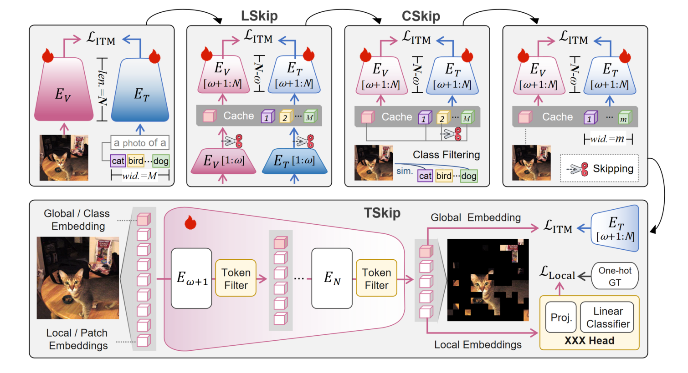
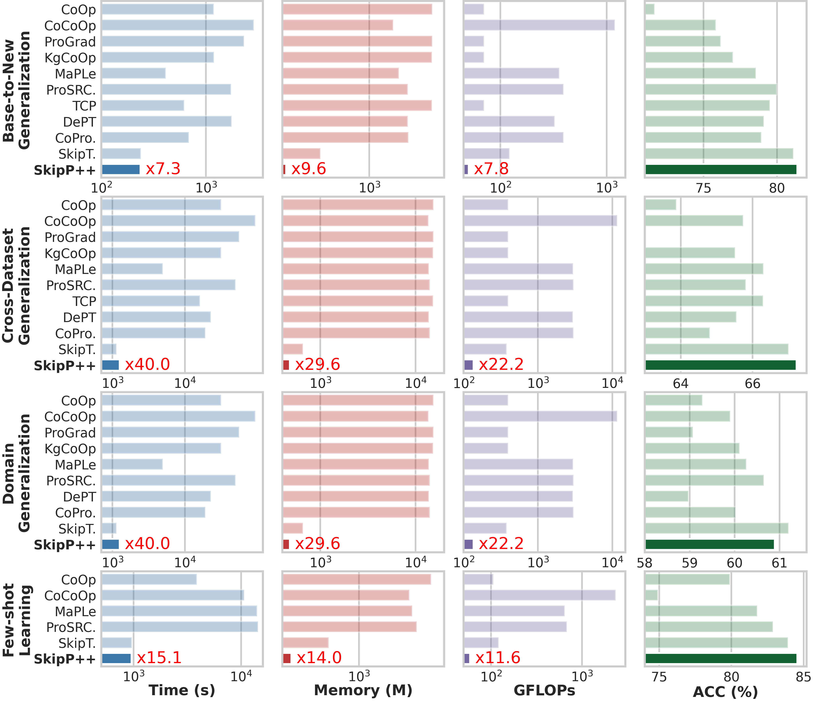
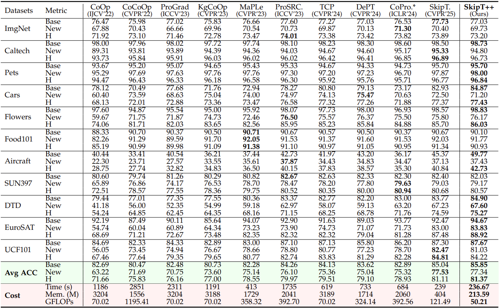
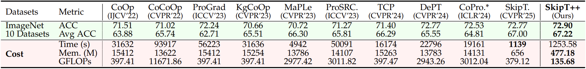
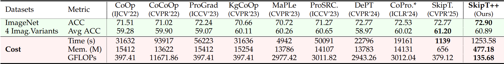
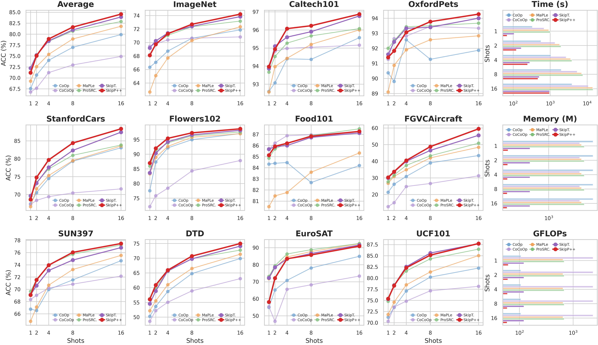

# SkipT++: Structural-Spatial Skip Tuning for Effective and Efficient VLM Adaptation

Official implementation of **SkipT++**.

----

# News

- (Aug. 18, 2026) Training and evaluation codes for SkipT++ are released.

----

# Highlights

> **Abstract** Prompt tuning (PT) has long been recognized as an effective and efficient paradigm for transferring large pre-trained vision-language models (VLMs) to downstream tasks by learning a tiny set of context vectors. Nevertheless, freezing the parameters of VLMs while learning those context vectors neither facilitates the transferability of pre-trained knowledge nor improves memory, time, and computational efficiency significantly. Upon further investigation, we find that reducing the length, width, and spatial token sequence of the feature-gradient propagation flows (FGPFs) of the full fine-tuning (FT) baseline is key to achieving effective and efficient knowledge transfer. Motivated by this, we propose SkipT++, a structural-spatial skip tuning paradigm for adapting VLMs to downstream tasks. Unlike existing PT or adapter-based methods, SkipT++ applies Layer-wise Skipping (LSkip), Class-wise Skipping (CSkip), and Token-wise Skipping (TSkip) upon the FT baseline without introducing extra context vectors or adapter modules. To enhance fine-grained recognition while keeping efficiency, we further design a Dual-Head Classification framework that jointly leverages global and local image features. Extensive experiments across a wide spectrum of benchmarks demonstrate the superior effectiveness and efficiency of SkipT++ over both PT and adapter-based methods.



----

# Main Contributions

> 1. We reveal that reducing the length, width, and spatial token sequence of the feature-gradient propagation flows (FGPFs) of the full fine-tuning (FT) baseline is key to establishing effective and efficient knowledge transfer.
>
> 2. We devise SkipT++, an effective and efficient structural-spatial skip tuning method for transferring VLMs to downstream tasks through LSkip, CSkip, and TSkip, without relying on extra context vectors or adapter modules.
>
> 3. We introduce learnable token compression (CompressRate) and a Dual-Head Classification framework that decouples and jointly uses global and local visual features to enhance fine-grained classification.
>
> 4. We evaluate our method on a wide spectrum of benchmarks, demonstrating the superiority of SkipT++ over both prompt tuning and adapter-based approaches.

----

# Efficiency and Effectiveness

Our SkipT++ achieves strong time, memory, and GFLOPs efficiency while remaining competitive in accuracy across different tasks.

<div align="center">
    
</div>

**Base-to-New Generalization**



**Cross-Dataset Generalization**



**Domain Generalization**



**Few-shot Learning**



----

# Installation

This codebase is tested on Ubuntu with Python 3.8/3.10. Follow the below steps to create environment and install dependencies.

Setup conda environment (recommended).

**Create a conda environment**

```
conda create -y -n skip-plus python=3.10
conda activate skip-plus
```

**Install torch and torchvision**

```
pip install torch==2.5.1 torchvision torchaudio --index-url https://download.pytorch.org/whl/cu121
```

**Install dassl**

```
git clone https://github.com/KaiyangZhou/Dassl.pytorch.git
cd Dassl.pytorch/
pip install -r requirements.txt
python setup.py develop
```

**Install SkipT++**

```
cd ..

git clone https://github.com/JXuanYu/Skip-Plus.git
cd Skip-Plus/

pip install -r requirements.txt
pip install setuptools==59.5.0
```

----

# Data preparation

Please follow the instructions at [DATASETS.md](datasets/DATASETS.md) to prepare all datasets.

----

# Training and Evaluation

We provide parallel running script `parallel_runner.py` for SkipT++ as well as prompting variants including CoOp, CoCoOp, ProGrad, KgCoOp, MaPLe, PromptSRC, TCP, KgDePT and CoPrompt, and adapter-based variant CLIP-Adapter, together with SkipTuning.

**Configure the paths in `configs.py`**

```python
ROOT = "/your/project/root/here"

base = dict(
    # dataset configs
    data = dict(
        root=f'{ROOT}/datasets/DATA',
        ...
    ),

    # mail configs
    mail = dict(
        username='your@mail.com',
        password='your_mail_password_here',
        host='your.host.com',
        to='your@mail.com',
    ),

    # output configs
    output = dict(
        root=f'{ROOT}/outputs',
        result=f'{ROOT}/results/acc',
        cost=f'{ROOT}/results/cost',
        remove_dirs=['dirs removed before running'],
    ),
)
```

**Configure tasks in `configs.py`**

```python
pipeline = [
    # pipelines will be run in parallel
    # Pipeline 1
    dict(
        # GPUs for this pipeline
        gpu_ids=[0, 1, 2],
        # tasks in this pipeline will be run sequentially
        tasks=[
            'skip_plus',
            'skip_plus_xd',
            'skip_plus_all',
        ]
    ),
    # Pipeline 2
    dict(
        gpu_ids=[3, 4, 5],
        tasks=[
            'skip_plus',
        ]
    )
]
```

Baseline methods can be configured in `configs_baseline.py` in the same way.

After running, the output will be in `{ROOT}/outputs`, results including accuracy and cost will be in `{ROOT}/results/acc` and `{ROOT}/results/cost`.

```
python parallel_runner.py
```

If you want to add your own models, you'll need to write your models in the `trainers/` directory and register them in dassl, then configure the settings in the `configs/` directory and `configs.py` file. Then you can run `python parallel_runner.py` to run your own model.

----

# Acknowledgements

Our code is based on [Dassl.pytorch](https://github.com/KaiyangZhou/Dassl.pytorch), [CLIP](https://github.com/openai/CLIP) and [SkipTuning](https://github.com/Koorye/SkipTuning) repositories. We thank the authors for releasing their code. If you use our model and code, please consider citing these works as well.
